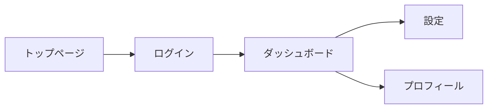

# 画面設計書

## 1. 画面一覧

| 画面ID | 画面名 | URL | 認証 | 説明 |
|--------|--------|-----|------|------|
| SCR-001 | トップページ | `/` | 不要 | アプリのランディングページ |
| SCR-002 | ログイン | `/login` | 不要 | ユーザー認証画面 |
| SCR-003 | ダッシュボード | `/dashboard` | 必要 | メイン画面 |

---

## 2. 画面遷移図

<!-- Figmaのリンクやスクリーンショットを貼り付け -->

---

## 3. 画面詳細

### SCR-001: トップページ

#### 3.1 概要
<!-- この画面の目的と役割 -->

#### 3.2 レイアウト
<!-- 画面のレイアウト説明、またはFigmaリンク -->

#### 3.3 表示要素

| 要素ID | 要素名 | 種類 | 説明 |
|--------|--------|------|------|
| EL-001 | ヘッダーロゴ | 画像 | アプリケーションロゴ |
| EL-002 | ログインボタン | ボタン | ログイン画面へ遷移 |
| EL-003 | 機能紹介セクション | テキスト | アプリの主要機能を紹介 |

#### 3.4 操作フロー

1. ユーザーがページにアクセス
2. ヘッダーとメインコンテンツが表示される
3. 「ログイン」ボタンをクリック
4. ログイン画面(SCR-002)へ遷移

#### 3.5 バリデーション
<!-- フォームがある場合のバリデーションルール -->

#### 3.6 エラーハンドリング
<!-- エラー時の表示内容 -->

---

### SCR-002: ログイン画面

#### 3.1 概要
<!-- 以下同様に記述 -->

#### 3.2 レイアウト

#### 3.3 表示要素

| 要素ID | 要素名 | 種類 | 説明 |
|--------|--------|------|------|
| EL-010 | メールアドレス入力 | テキストフィールド | ユーザーのメールアドレス |
| EL-011 | パスワード入力 | パスワードフィールド | ユーザーのパスワード |
| EL-012 | ログインボタン | ボタン | 認証を実行 |

#### 3.4 操作フロー

1. メールアドレスとパスワードを入力
2. 「ログイン」ボタンをクリック
3. バリデーション実行
4. 認証API呼び出し
5. 成功時: ダッシュボード(SCR-003)へ遷移
6. 失敗時: エラーメッセージ表示

#### 3.5 バリデーション

- メールアドレス: 必須、メール形式
- パスワード: 必須、8文字以上

#### 3.6 エラーハンドリング

- 認証失敗: 「メールアドレスまたはパスワードが正しくありません」
- ネットワークエラー: 「通信エラーが発生しました。もう一度お試しください」

---

## 4. 共通UI要素

### 4.1 ヘッダー
<!-- 全画面共通のヘッダー仕様 -->

### 4.2 フッター
<!-- 全画面共通のフッター仕様 -->

### 4.3 ナビゲーション
<!-- サイドバーやメニューの仕様 -->

### 4.4 モーダル
<!-- モーダルダイアログの仕様 -->

---

## 5. レスポンシブ対応

### 5.1 ブレークポイント

- モバイル: 〜768px
- タブレット: 769px〜1024px
- デスクトップ: 1025px〜

### 5.2 各デバイスでの表示変更点
<!-- デバイスごとの表示の違い -->
