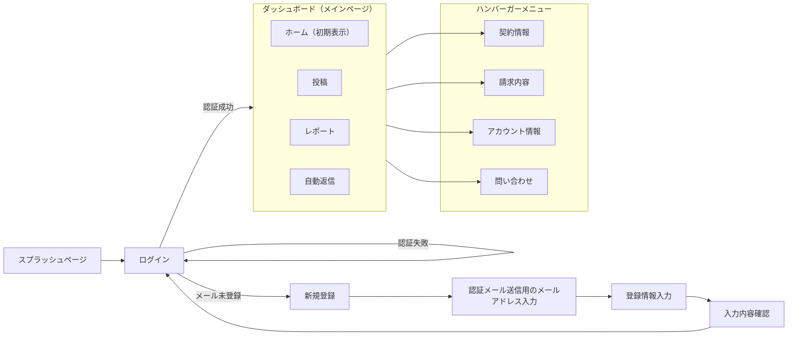

# 画面設計書

## 1. 画面一覧

| 画面ID | 画面名 | URL | 認証 | 説明 |
|--------|--------|-----|------|------|
| Wyze-E | トップページ | `/` | 不要 | アプリのランディングページ |
| Wyze-L | ログイン | `/login` | 不要 | ユーザー認証画面 |
| Wyze-S | 新規登録 | `/signin` | 不要 | ユーザー登録画面 |
| Wyze-D | ダッシュボード | `/dashboard` | 必要 | メイン画面,ログイン後の初期値 |
| Wyze-D-Post | 投稿 | `/post` | 必要 | (ダッシュボードからのタブ移動)|
| Wyze-D-Report | レポート | `/report` | 必要 | (ダッシュボードからのタブ移動)|
| Wyze-D-Report-Monthly | 月次レポート | `/report/overview` | 必要 | レポートタブ初期値|
| Wyze-D-Report-Detail | 詳細レポート | `/report/detail` | 必要 | レポートタブ初期値|
| Wyze-D-Reply | 口コミ返信 | `/reply` | 必要 | (ダッシュボードからのタブ移動)|
| Wyze-P | プラン | `/plan` | 必要 | ユーザーが契約しているプラン情報 |
| Wyze-B | 支払い情報 | `/billing` | 必要 | ユーザーの支払い情報 |
| Wyze-A | アカウント | `/account` | 必要 | アカウント情報 |

---

## 2. 画面遷移図

---

## 3. 画面詳細

### Wyze-launch (起動フロー)

#### 1. 概要

- アプリ起動からログインまたは新規登録を経て、メインコンテンツ（ダッシュボード）へ遷移するまでの一連のフロー。
- Figmaデザインに基づき、スプラッシュ表示後にランディング画面へ遷移し、そこからログインまたは新規登録を選択する。

#### 2. 画面フロー詳細

1. **スプラッシュ (Splash)**
   - アプリ起動時に表示。ブランドロゴを表示。
   - 自動ログイン判定を行い、認証済みならダッシュボードへ、未認証ならランディングへ遷移。

2. **ランディング (Landing)**
   - 未認証ユーザーが最初に到達する画面。
   - 「ログイン」ボタンと「新規登録」ボタンを配置。
   - アプリのキャッチコピーや主要機能を訴求するスライドショーなどを配置してもよい（デザイン参照）。

3. **ログイン (Login)**
   - メールアドレス・パスワードによる認証。
   - 「ログイン」実行でダッシュボードへ。
   - 「パスワードを忘れた場合」のリンクあり。

4. **新規登録 (Sign Up)**
   - 新規ユーザー登録フロー。
   - メールアドレス入力 -> 認証 -> プロフィール設定等のステップを踏む（デザインによりステップ数は可変）。

#### 3. 構成要素 (共通)

- **基本カラー**: メインカラー（Figmaデザインのグリーン）を基調とする。
- **ボタン**: Primaryボタンはグリーン背景に白文字。Secondaryボタンは白背景にグリーンの枠線など。
- **入力フォーム**: 枠線付きのテキストフィールド。エラー時は赤色枠線＋エラーメッセージ。

#### 4. 各画面UI仕様

##### Wyze-E (Landing)

| 要素ID | 要素名 | 種類 | 説明 |
|---|---|---|---|
| E-01 | ロゴマーク | 画像 | ヘッダーまたは画面中央上部に配置 |
| E-02 | ログインボタン | ボタン(Secondary) | ログイン画面へ遷移 |
| E-03 | 新規登録ボタン | ボタン(Primary) | 新規登録画面へ遷移 |

##### Wyze-L (Login)

| 要素ID | 要素名 | 種類 | 説明 |
|---|---|---|---|
| L-01 | メールアドレス入力 | Input |  |
| L-02 | パスワード入力 | Input(Password) |  |
| L-03 | ログイン実行ボタン | ボタン(Primary) | バリデーション後、認証APIをコール |
| L-04 | 新規登録リンク | リンク | アカウントがない場合の導線 |
| L-05 | パスワード忘却リンク | リンク |  |

##### Wyze-S (Sign Up)

以降、ステップに応じた入力項目（メールアドレス、パスワード、確認用パスワード、ユーザー名など）。
planBプロジェクトのsignupデザインを流用

---

### Wyze-D (Dashboard & Main Flow)

#### 1. 概要

ログイン後のメイン機能群。ユーザーの契約プラン（Light / Basic / Pro）によって表示される機能や情報量が異なる。
下部ナビゲーション（タブバー）により、主要機能へ素早くアクセスできる。

#### 2. プラン別UIの差異

- **Light Plan**: 必要最小限の機能のみ表示。レポート機能などが制限される可能性がある（デザイン上、表示項目が少ない）。
- **Basic Plan**: 標準的な機能を表示。
- **Pro Plan**: 全機能を表示。詳細な分析グラフ（ドーナツチャート等）や高度なレポート機能へのアクセスが含まれる。

#### 3. 共通レイアウト (Bottom Navigation)

画面下部に固定されたナビゲーションバー。以下のタブを含む（左から順）：

1. **ホーム (Home)**: ダッシュボードトップ。
2. **投稿 (Post)**: 新規投稿作成。
3. **レポート (Report)**: 分析結果の閲覧。
4. **メニュー (Menu)**: その他の設定、アカウント情報など。

#### 4. ダッシュボード画面UI仕様

##### Wyze-H (Dashboard 内 ホームタブ)

ホーム画面。プランに応じたサマリー情報を表示する。

| 要素ID | 要素名 | 種類 | 説明 |
|---|---|---|---|
| H-01-00 |未連携時ホーム画面 | ホーム画面 | ログインした直後,又は連携設定をしてない時のホーム画面 |
| H-01-G | GoogleMap連携時ホーム画面 | ホーム画面 | GoogleMapとのみ連携設定をした時のホーム画面 |
| H-01-I | Instagram連携時ホーム画面 | ホーム画面 | Instagramとのみ連携設定をした時のホーム画面 |
| H-01-IG | Instagram+GoogleMap連携時ホーム画面 | ホーム画面 | GoogleMapとInstagram両方と連携設定をした時のホーム画面 |
| H-02 | Basicプランユーザーの時のホーム画面 | ホーム画面 | Basicプランユーザーの時のホーム画面 |
| H-03 | Proプランユーザーの時のホーム画面 | ホーム画面 | Proプランユーザーの時のホーム画面 |

##### Wyze-Post (Dashboard 内 投稿タブ)

- インスタに投稿したポスト一覧を表示。

| 要素ID | 要素名 | 種類 | 説明 |
|---|---|---|---|
|P-01-01|投稿一覧-グリッド表示|グリッド|投稿済みコンテンツのサムネイル一覧表示|
|P-01-01|投稿一覧-リスト表示|リスト|投稿済みコンテンツのサムネイル一覧表示|
|P-01-XX-01|表示中投稿詳細|モーダル|表示中投稿の詳細情報表示モーダル|
|P-01-XX-02|非表示投稿詳細|モーダル|非表示投稿の詳細情報表示モーダル|

##### Wyze-Report (レポート画面)

- **Pro**: 詳細なグラフ（円グラフ、棒グラフ）でインサイトを提供。
- **Basic**: 基本的な数値のみ、またはアップグレード訴求。
- **Light**: 詳細レポート画面は非表示。

| 要素ID | 要素名 | 種類 | 説明 |
|---|---|---|---|
| Report-01 | 月次レポート画面 | レポート画面 | 月次レポートの表示 |
| Report-02-B | Basicプラン用詳細レポート画面 | レポート画面 | 基本的な数値表示 |
| Report-02-P | Proプラン用詳細レポート画面 | レポート画面 | 詳細なグラフ表示 |

##### Wyze-Reply (口コミ返信画面)

- GoogleMapの口コミ一覧表示と返信機能。

| 要素ID | 要素名 | 種類 | 説明 |
|---|---|---|---|
| Reply-01 | 口コミ一覧 | リスト | GoogleMapから取得した口コミの一覧表示 |

##### Wyze-Menu (メニュー画面)

- アカウント設定、プラン変更、ログアウトなどの設定項目一覧。
- ハンバーガーメニューからアクセス。

| 要素ID | 要素名 | 種類 | 説明 |
|---|---|---|---|
| Menu-01 | プラン情報 | リンク | ユーザーの契約プラン情報へ遷移 |

#### Wyze-Plan (プラン画面)

#### Wyze-Billing (支払い情報画面)

#### Wyze-Account (アカウント画面)

---

## 4. 共通UI要素

### 4.1 ヘッダー
<!-- 全画面共通のヘッダー仕様 -->

### 4.2 フッター
<!-- 全画面共通のフッター仕様 -->

### 4.3 ナビゲーション
<!-- サイドバーやメニューの仕様 -->

### 4.4 モーダル
<!-- モーダルダイアログの仕様 -->

---

## 5. レスポンシブ対応

### 5.1 ブレークポイント

- モバイル: 〜768px
- タブレット: 769px〜1024px
- デスクトップ: 1025px〜

### 5.2 各デバイスでの表示変更点
<!-- デバイスごとの表示の違い -->
