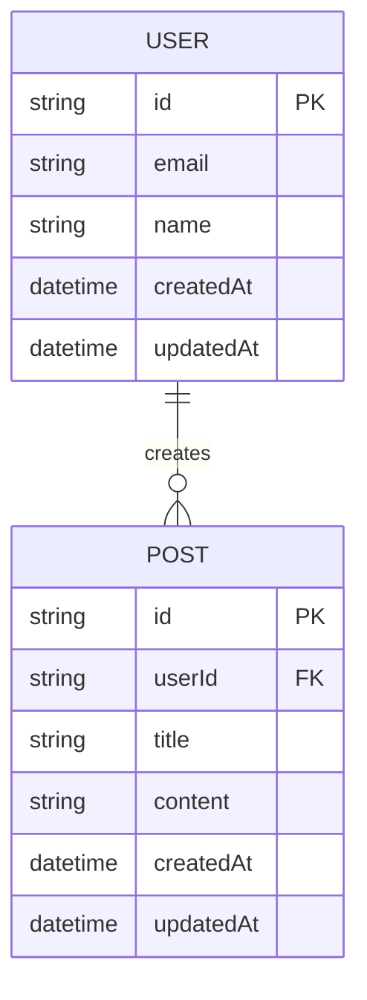
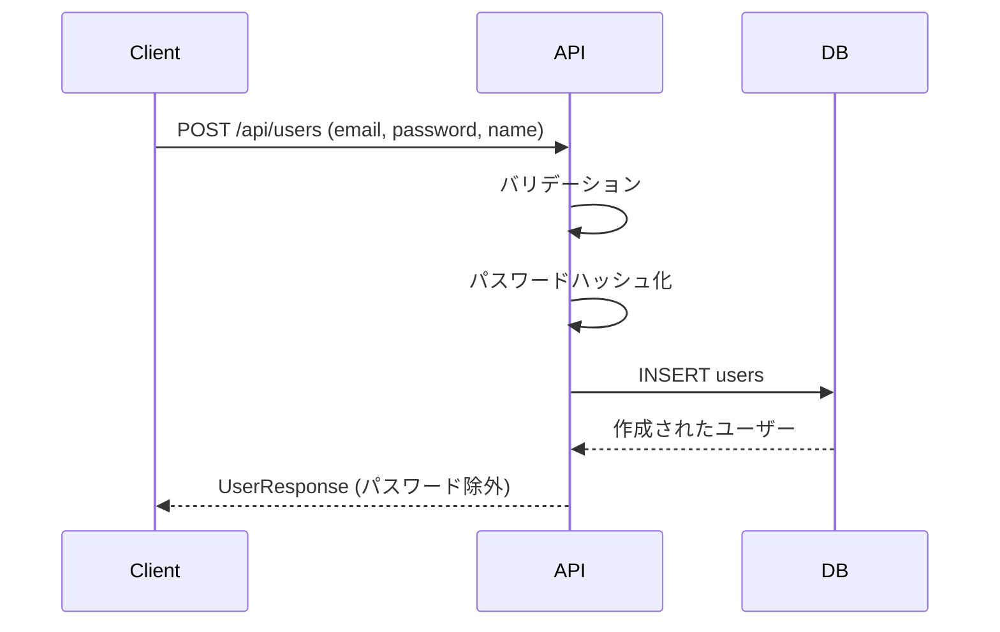
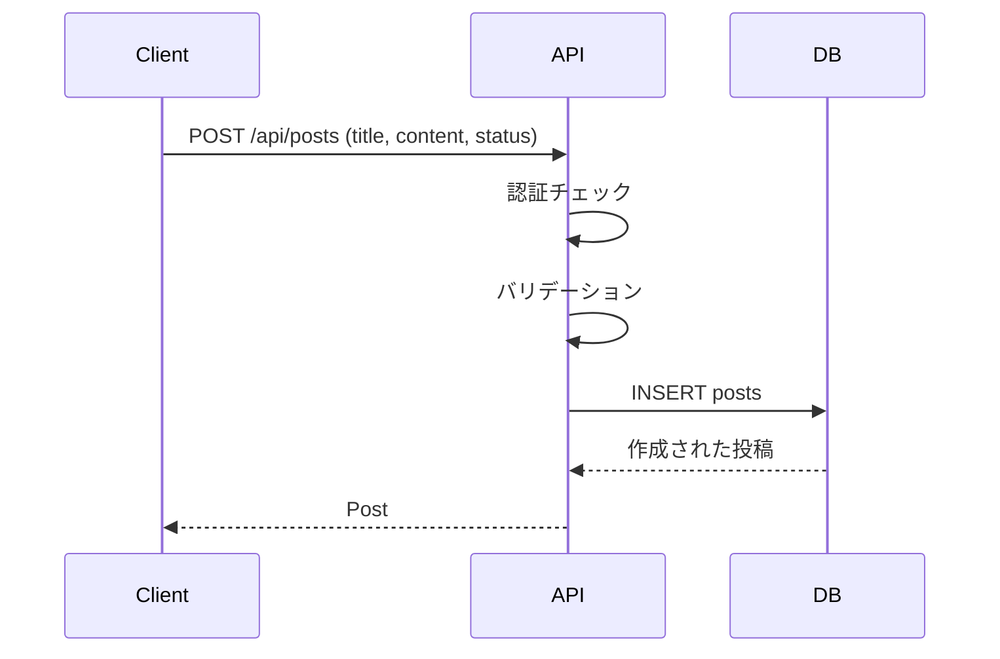

# データ設計書

## 1. データモデル概要

### 1.1 ER図



---

## 2. テーブル定義

### 2.1 users テーブル

#### 概要
ユーザー情報を管理するテーブル

#### カラム定義

| カラム名 | 型 | NULL | デフォルト | 説明 |
|----------|-----|------|-----------|------|
| id | VARCHAR(36) | NO | UUID | ユーザーID (主キー) |
| email | VARCHAR(255) | NO | - | メールアドレス (ユニーク) |
| password_hash | VARCHAR(255) | NO | - | ハッシュ化されたパスワード |
| name | VARCHAR(100) | NO | - | ユーザー名 |
| avatar_url | VARCHAR(500) | YES | NULL | プロフィール画像URL |
| created_at | TIMESTAMP | NO | CURRENT_TIMESTAMP | 作成日時 |
| updated_at | TIMESTAMP | NO | CURRENT_TIMESTAMP | 更新日時 |

#### インデックス

- PRIMARY KEY: `id`
- UNIQUE INDEX: `email`
- INDEX: `created_at`

#### 制約

- `email`: メール形式、ユニーク制約
- `password_hash`: 最小60文字 (bcryptハッシュ)
- `name`: 1文字以上100文字以下

---

### 2.2 posts テーブル

#### 概要
投稿情報を管理するテーブル

#### カラム定義

| カラム名 | 型 | NULL | デフォルト | 説明 |
|----------|-----|------|-----------|------|
| id | VARCHAR(36) | NO | UUID | 投稿ID (主キー) |
| user_id | VARCHAR(36) | NO | - | ユーザーID (外部キー) |
| title | VARCHAR(200) | NO | - | 投稿タイトル |
| content | TEXT | NO | - | 投稿本文 |
| status | ENUM | NO | 'draft' | ステータス (draft/published/archived) |
| published_at | TIMESTAMP | YES | NULL | 公開日時 |
| created_at | TIMESTAMP | NO | CURRENT_TIMESTAMP | 作成日時 |
| updated_at | TIMESTAMP | NO | CURRENT_TIMESTAMP | 更新日時 |

#### インデックス

- PRIMARY KEY: `id`
- FOREIGN KEY: `user_id` REFERENCES `users(id)` ON DELETE CASCADE
- INDEX: `user_id, created_at`
- INDEX: `status, published_at`

#### 制約

- `title`: 1文字以上200文字以下
- `content`: 必須
- `status`: 'draft', 'published', 'archived' のいずれか

---

## 3. データ型定義 (TypeScript)

### 3.1 User型

```typescript
interface User {
  id: string;
  email: string;
  name: string;
  avatarUrl?: string;
  createdAt: Date;
  updatedAt: Date;
}

// API レスポンス用 (パスワードハッシュを除外)
type UserResponse = Omit<User, 'passwordHash'>;

// 作成時の入力型
interface CreateUserInput {
  email: string;
  password: string;
  name: string;
}

// 更新時の入力型
interface UpdateUserInput {
  name?: string;
  avatarUrl?: string;
}
```

### 3.2 Post型

```typescript
interface Post {
  id: string;
  userId: string;
  title: string;
  content: string;
  status: 'draft' | 'published' | 'archived';
  publishedAt?: Date;
  createdAt: Date;
  updatedAt: Date;
}

// 作成時の入力型
interface CreatePostInput {
  title: string;
  content: string;
  status?: 'draft' | 'published';
}

// 更新時の入力型
interface UpdatePostInput {
  title?: string;
  content?: string;
  status?: 'draft' | 'published' | 'archived';
}

// ユーザー情報を含む投稿型
interface PostWithUser extends Post {
  user: UserResponse;
}
```

---

## 4. バリデーションルール

### 4.1 User

| フィールド | ルール |
|-----------|--------|
| email | 必須、メール形式、ユニーク、最大255文字 |
| password | 必須、最小8文字、英数字記号を含む |
| name | 必須、1〜100文字 |
| avatarUrl | URL形式、最大500文字 |

### 4.2 Post

| フィールド | ルール |
|-----------|--------|
| title | 必須、1〜200文字 |
| content | 必須、1文字以上 |
| status | 'draft', 'published', 'archived' のいずれか |

---

## 5. データフロー

### 5.1 ユーザー登録フロー



### 5.2 投稿作成フロー



---

## 6. ストレージ設計

### 6.1 ファイルストレージ

<!-- 画像やファイルのアップロード先 -->

- サービス: (AWS S3 / Google Cloud Storage / Firebase Storage など)
- バケット構成:
  - `avatars/`: ユーザーアバター画像
  - `posts/`: 投稿に添付された画像
- ファイル命名規則: `{userId}/{timestamp}_{originalFilename}`
- 最大ファイルサイズ: 5MB
- 許可する拡張子: .jpg, .jpeg, .png, .gif

### 6.2 キャッシュ設計

<!-- Redisなどのキャッシュ戦略 -->

- キャッシュキー命名規則:
  - ユーザー情報: `user:{userId}`
  - 投稿一覧: `posts:list:{page}:{limit}`
- TTL (有効期限):
  - ユーザー情報: 1時間
  - 投稿一覧: 5分

---

## 7. データ移行・シード

### 7.1 初期データ

<!-- 開発環境で必要な初期データ -->

```typescript
// 管理者ユーザー
const adminUser = {
  email: 'admin@example.com',
  password: 'Admin123!',
  name: '管理者'
};

// テストユーザー
const testUsers = [
  { email: 'user1@example.com', password: 'User123!', name: 'テストユーザー1' },
  { email: 'user2@example.com', password: 'User123!', name: 'テストユーザー2' }
];
```

### 7.2 マイグレーション戦略

<!-- データベーススキーマの変更管理方法 -->

- ツール: (Prisma / TypeORM / Knex.js など)
- マイグレーションファイルの命名: `YYYYMMDDHHMMSS_description.sql`
