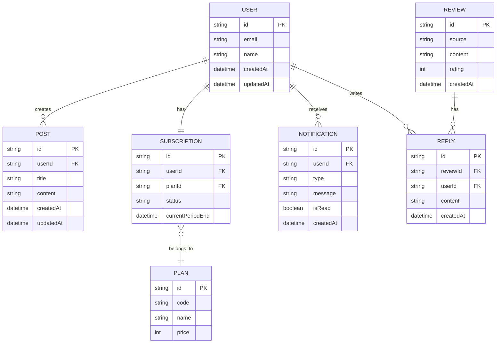
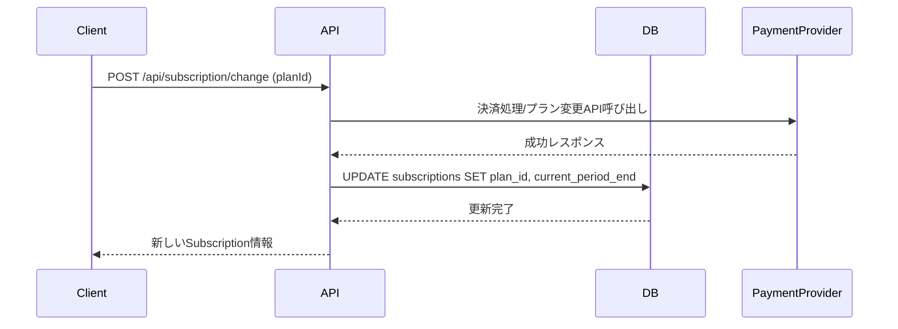
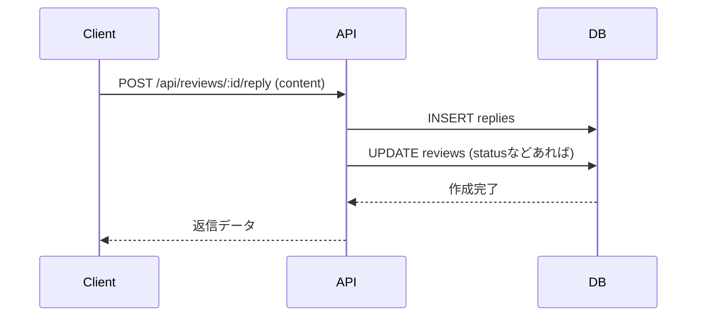

# データ設計書

## 1. データモデル概要

### 1.1 ER図



---

## 2. テーブル定義

### 2.1 users テーブル

#### 概要

ユーザー情報を管理するテーブル

#### カラム定義

| カラム名 | 型 | NULL | デフォルト | 説明 |
|----------|-----|------|-----------|------|
| id | VARCHAR(36) | NO | UUID | ユーザーID (主キー) |
| email | VARCHAR(255) | NO | - | メールアドレス (ユニーク) |
| password_hash | VARCHAR(255) | NO | - | ハッシュ化されたパスワード |
| name | VARCHAR(100) | NO | - | ユーザー名 |
| avatar_url | VARCHAR(500) | YES | NULL | プロフィール画像URL |
| created_at | TIMESTAMP | NO | CURRENT_TIMESTAMP | 作成日時 |
| updated_at | TIMESTAMP | NO | CURRENT_TIMESTAMP | 更新日時 |

#### インデックス

- PRIMARY KEY: `id`
- UNIQUE INDEX: `email`

### 2.2 plans テーブル

#### 概要

料金プラン（Light / Basic / Pro）のマスタデータ

#### カラム定義

| カラム名 | 型 | NULL | デフォルト | 説明 |
|----------|-----|------|-----------|------|
| id | VARCHAR(36) | NO | UUID | プランID (主キー) |
| code | VARCHAR(20) | NO | - | プランコード (light, basic, pro) |
| name | VARCHAR(50) | NO | - | 表示用プラン名 |
| price | INT | NO | 0 | 月額料金 |
| features | JSON | YES | NULL | プラン機能定義（JSON） |
| created_at | TIMESTAMP | NO | CURRENT_TIMESTAMP | 作成日時 |

### 2.3 subscriptions テーブル

#### 概要

ユーザーの契約情報を管理

#### カラム定義

| カラム名 | 型 | NULL | デフォルト | 説明 |
|----------|-----|------|-----------|------|
| id | VARCHAR(36) | NO | UUID | サブスクリプションID (主キー) |
| user_id | VARCHAR(36) | NO | - | ユーザーID (外部キー) |
| plan_id | VARCHAR(36) | NO | - | プランID (外部キー) |
| status | ENUM | NO | 'active' | active, canceled, past_due |
| current_period_end | TIMESTAMP | NO | - | 契約終了予定日 |
| created_at | TIMESTAMP | NO | CURRENT_TIMESTAMP | 作成日時 |
| updated_at | TIMESTAMP | NO | CURRENT_TIMESTAMP | 更新日時 |

### 2.4 posts テーブル

#### 概要

投稿情報を管理

#### カラム定義

| カラム名 | 型 | NULL | デフォルト | 説明 |
|----------|-----|------|-----------|------|
| id | VARCHAR(36) | NO | UUID | 投稿ID (主キー) |
| user_id | VARCHAR(36) | NO | - | ユーザーID (外部キー) |
| title | VARCHAR(200) | NO | - | 投稿タイトル |
| content | TEXT | NO | - | 投稿本文 |
| status | ENUM | NO | 'draft' | ステータス (draft/published/archived) |
| published_at | TIMESTAMP | YES | NULL | 公開日時 |
| created_at | TIMESTAMP | NO | CURRENT_TIMESTAMP | 作成日時 |
| updated_at | TIMESTAMP | NO | CURRENT_TIMESTAMP | 更新日時 |
| customers_induction_rate | INT | NO | 0 | 集客誘導率 |
|profile_view| INT | NO | 0 | プロフィ-ル閲覧回数 |

### 2.5 reviews テーブル

#### 概要

GoogleMapから取得する店につけられた口コミデータ

#### カラム定義

| カラム名 | 型 | NULL | デフォルト | 説明 |
|----------|-----|------|-----------|------|
| id | VARCHAR(36) | NO | UUID | レビューID |
| source | VARCHAR(50) | NO | 'internal' | ソース (google_maps, internal等) |
| external_id | VARCHAR(255) | YES | NULL | 外部サービスのID |
| content | TEXT | NO | - | 口コミ内容 |
| img_url | VARCHAR(500) | YES | NULL | 口コミ画像URL |
| rating | INT | NO | - | 評価 (1-5) |
| created_at | TIMESTAMP | NO | CURRENT_TIMESTAMP | 作成日時 |

### 2.6 replies テーブル

#### 概要

口コミへの返信

#### カラム定義

| カラム名 | 型 | NULL | デフォルト | 説明 |
|----------|-----|------|-----------|------|
| id | VARCHAR(36) | NO | UUID | 返信ID |
| review_id | VARCHAR(36) | NO | - | 対象レビューID |
| replied | BOOLEAN | NO | FALSE | 返信済み/未返信 |
| content | TEXT | NO | - | 返信内容 |
| created_at | TIMESTAMP | NO | CURRENT_TIMESTAMP | 作成日時 |
| replied_at | TIMESTAMP | YES | NULL | 返信日時 |
| status | ENUM | NO | 'pending' | ステータス (pending/posted/failed) |
| recommend_repliled_rate | FLOAT | NO | 0 | 返信推奨度 |

### 2.7 notifications テーブル

#### 概要

ユーザーへの通知

#### カラム定義

| カラム名 | 型 | NULL | デフォルト | 説明 |
|----------|-----|------|-----------|------|
| id | VARCHAR(36) | NO | UUID | 通知ID |
| user_id | VARCHAR(36) | NO | - | 通知先ユーザーID |
| type | VARCHAR(50) | NO | - | 通知タイプ (system, reply, etc) |
| message | VARCHAR(255) | NO | - | 通知文言 |
| is_read | BOOLEAN | NO | FALSE | 既読フラグ |
| link_url | VARCHAR(500) | YES | NULL | 遷移先URL |
| created_at | TIMESTAMP | NO | CURRENT_TIMESTAMP | 作成日時 |

---

## 3. データ型定義 (TypeScript)

### 3.1 ユーザー・契約関連

```typescript
interface User {
  id: string;
  email: string;
  name: string;
  avatarUrl?: string;
  createdAt: Date;
  updatedAt: Date;
}

interface Plan {
  id: string;
  code: 'light' | 'basic' | 'pro';
  name: string;
  price: number;
  features: Record<string, boolean>; // { "report_detail": true, "analysis_chart": false }
}

interface Subscription {
  id: string;
  userId: string;
  planId: string;
  status: 'active' | 'canceled' | 'past_due';
  currentPeriodEnd: Date;
  plan?: Plan; // Join用
}
```

### 3.2 投稿・レビュー関連

```typescript
interface Post {
  id: string;
  userId: string;
  title: string;
  content: string;
  status: 'draft' | 'published' | 'archived';
  publishedAt?: Date;
  createdAt: Date;
  updatedAt: Date;
}

interface Review {
  id: string;
  source: string;
  content: string;
  rating: number;
  createdAt: Date;
  replies?: Reply[];
}

interface Reply {
  id: string;
  reviewId: string;
  userId: string;
  content: string;
  createdAt: Date;
}

interface Notification {
  id: string;
  userId: string;
  type: 'system' | 'reply' | 'alert';
  message: string;
  isRead: boolean;
  linkUrl?: string;
  createdAt: Date;
}
```

---

## 4. データフロー

### 4.1 契約更新・変更フロー



### 4.2 口コミ返信フロー



---

## 5. ストレージ設計

### 5.1 ファイルストレージ

- サービス: (AWS S3 / Google Cloud Storage / Firebase Storage など)
- バケット構成:
  - `avatars/`: ユーザーアバター
  - `posts/`: 投稿画像
- ファイル命名規則: `{userId}/{timestamp}_{originalFilename}`

### 5.2 キャッシュ設計

- **ユーザー情報**: `user:{userId}` (TTL: 1h)
- **ダッシュボード統計**: `dashboard:stats:{userId}` (TTL: 10m) - 計算コスト削減
- **プランマスタ**: `plans:all` (TTL: 24h) - 変更頻度低

---

## 6. 初期データ (Seed)

```typescript
// プランマスタ
const plans = [
  { code: 'light', name: 'Light Plan', price: 980 },
  { code: 'basic', name: 'Basic Plan', price: 2980 },
  { code: 'pro', name: 'Pro Plan', price: 9800 }
];
```
