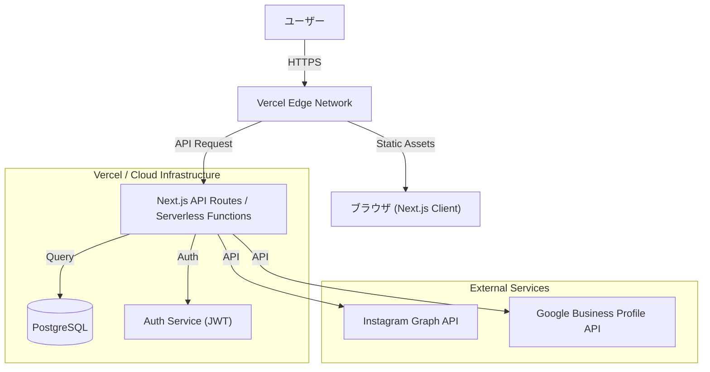

# 技術仕様書

## 1. アーキテクチャ概要

### 1.1 システム構成図


### 1.2 技術スタック

### 1.2 サーバーレスアーキテクチャの採用
本システムでは、**Next.js** と **Vercel** を組み合わせたサーバーレスアーキテクチャを採用します。これにより、インフラ管理の手間を最小限に抑えつつ、高いスケーラビリティとコスト効率を実現します。
- **API Routes as Serverless Functions**:
  - `pages/api/` ディレクトリ内に作成されたファイルは、Vercelへのデプロイ時にそれぞれが独立したサーバーレス関数（Serverless Function）としてデプロイされます。
  - 各APIエンドポイントは、リクエストに応じて個別に起動・実行され、処理が完了すると自動的に停止します。
- **主なメリット**:
  - **自動スケーリング**: トラフィックの増減に応じて、Vercelが自動的にリソースを割り当てます。これにより、アクセス集中時にも安定したパフォーマンスを維持します。
  - **コスト効率**: リクエストが発生したときのみコンピューティングリソースが消費されるため、アイドル時間帯のコストが発生しません。
  - **運用負荷の軽減**: サーバーのプロビジョニング、OSのパッチ適用、セキュリティ管理といったインフラ運用業務が不要になります。
### 1.3 技術スタ
#### フロントエンド

| カテゴリ | 技術 | バージョン | 用途 |
|---------|------|-----------|------|
| フレームワーク | Next.js | 14.x | Reactフレームワーク |
| UI ライブラリ | React | 18.x | UIコンポーネント |
| 言語 | TypeScript | 5.x | 型安全な開発 |
| スタイリング |  Tailwind CSS | - | スタイリング |
| 状態管理 | | - | グローバル状態管理 |
| フォーム | React Hook Form | - | フォーム管理 |
| バリデーション |  | - | スキーマバリデーション |
| HTTP クライアント | | - | API通信 |
| スタイリング |  Tailwind CSS | 3.x | スタイリング |
| アイコン | React Icons | 5.x | アイコンセット |
| 状態管理 | React Context / Hooks | - | グローバル状態管理 |
| フォーム | React Hook Form | (導入予定) | フォーム管理 |
| ユーティリティ | clsx / tailwind-merge | - | クラス名操作 (utils/cn.ts) |

#### バックエンド

| カテゴリ | 技術 | バージョン | 用途 |
|---------|------|-----------|------|
| ランタイム | Node.js | 20.x | API実行環境 |
| フレームワーク | Next.js API Routes | 14.x | APIエンドポイント |
| ORM | Prisma | (導入予定) | データベース操作 |
| 認証 | JWT (Custom / NextAuth) | - | 認証・セッション管理 |

#### データベース

| カテゴリ | 技術 | 用途 |
|---------|------|------|
| RDBMS | PostgreSQL | メインデータベース (ユーザー、投稿、契約情報) |
| Hosting | Supabase / Vercel Postgres | (推奨) マネージドデータベース |


#### インフラ・DevOps

| カテゴリ | 技術 | 用途 |
|---------|------|------|
| ホスティング | Vercel| アプリケーションデプロイ |
| CI/CD | GitHub Actions | 自動テスト・デプロイ |
| バージョン管理 | Git / GitHub | ソースコード管理 |
| 監視 | Vercel Analytics | エラー監視・パフォーマンス監視 |


---

## 2. ディレクトリ構成

### 2.1 フロントエンド

.
├── components/          # Atomic Designに基づくコンポーネント
│   ├── atoms/           # 最小単位 (Button, Icon, Label, etc.)
│   ├── molecules/       # 複数のatomの組み合わせ (現状はorganismsに統合されている場合あり)
│   ├── organisms/       # 機能単位 (Header, SideMenu, Modal)
│   └── templates/       # ページのレイアウト (HomeTemplate, AccountTemplate)
├── docs/                # プロジェクトドキュメント
├── mcp/                 # MCP (Model Context Protocol) 関連設定
├── pages/               # ページルーティング (Next.js Pages Router)
│   ├── api/             # APIエンドポイント (バックエンドロジック)
│   ├── _app.tsx         # アプリケーションのエントリーポイント
│   └── ...              # 各ページ (home.tsx, account.tsx, etc.)
├── public/              # 静的アセット (画像, favicon)
├── styles/              # スタイルシート (globals.css)
├── test/                # テストファイル (Jest)
├── types/               # TypeScript型定義
├── utils/               # ユーティリティ関数 (cn.tsなど)
├── .env.local           # 環境変数 (Git対象外)
├── next.config.js       # Next.js設定
├── package.json         # 依存関係定義
└── tailwind.config.js   # Tailwind CSS設定
```
```

---

---

### 4. コーディング規約
### 4.1 TypeScript
- **厳格モード**: `strict: true` を使用
- **型定義**: `any` の使用を避け、適切な型を定義
- **厳格モード**: `strict: true` を使用 (tsconfig.jsonで設定済み)
- **型定義**: `any` の使用を極力避け、interface または type alias を定義する
- **インポート**: 絶対パス（エイリアス）の使用を推奨 (例: `@/components/...`) ※現状設定による
- **命名規則**:
  - 変数・関数: camelCase
  - クラス・型: PascalCase
  - クラス・型・コンポーネント: PascalCase
  - 定数: UPPER_SNAKE_CASE
  - ファイル名: kebab-case または PascalCase (コンポーネント)
  - ファイル名: PascalCase (コンポーネント), kebab-case (設定ファイル, ドキュメント)
### 4.2 React / Next.js
- **関数コンポーネント**: アロー関数で定義
- **Hooks**: カスタムフックは `use` プレフィックス
- **Props**: 型定義を必ず行う
- **ファイル構成**: 1ファイル1コンポーネント
- **コンポーネント定義**: 関数コンポーネント (FC) を使用
- **Props**: インターフェースで明示的に定義
- **Hooks**: トップレベルでのみ呼び出す。カスタムフックは `use` プレフィックスをつける
- **Atomic Design**: コンポーネントの粒度を意識して配置する (atoms, organisms, templates)
```typescript
// Good
// Good Example
import React from 'react';
interface ButtonProps {
  label: string;
  onClick: () => void;
  variant?: 'primary' | 'secondary';
  disabled?: boolean;
}
export const Button: React.FC<ButtonProps> = ({ label, onClick, variant = 'primary' }) => {
export const Button: React.FC<ButtonProps> = ({ 
  label, 
  onClick, 
  variant = 'primary',
  disabled = false 
}) => {
  return (
    <button className={`btn btn-${variant}`} onClick={onClick}>
    <button 
      className={`btn btn-${variant}`} 
      onClick={onClick}
      disabled={disabled}
    >
      {label}
    </button>
  );
};
```
### 4.3 CSS
### 4.3 CSS (Tailwind CSS)
- **BEM記法** または **CSS Modules** を使用
- **レスポンシブ**: モバイルファースト
- **命名**: 意味のある名前を使用
- **Utility First**: 基本的にTailwindのユーティリティクラスを使用する
- **条件付きクラス**: `utils/cn.ts` (clsx + tailwind-merge) を使用してクラスを結合・制御する
- **レスポンシブ**: モバイルファーストで記述する (`sm:`, `md:`, `lg:` プレフィックス)
```typescript
// Good Example
import { cn } from '@/utils/cn';
<div className={cn(
  "p-4 bg-white rounded-lg shadow-md",
  isActive && "border-2 border-blue-500"
)}>
  ...
</div>
```


---
## 5. テスト戦略
### 5.1 テストの種類
- **単体テスト (Unit Test)**:
  - 対象: ユーティリティ関数、Hooks、ロジックを持つ最小コンポーネント
  - ツール: Jest, React Testing Library
- **統合テスト (Integration Test)**:
  - 対象: ページ全体のレンダリング、API連携を含むフロー
  - ツール: Jest, React Testing Library (APIモック使用)
- **E2Eテスト**:
  - 対象: 重要なユーザージャーニー（ログイン、投稿、決済）
  - ツール: Playwright (推奨/将来導入)
### 5.2 テストコマンド
```bash
# テストの実行
npm test
# ウォッチモードで実行（開発中）
npm test -- --watch
# カバレッジの計測
npm test -- --coverage
```

---

## 6. デプロイ戦略

### 6.1 環境

| 環境 | 用途 | URL |
|------|------|-----|
| **Development** | ローカル開発環境 | http://localhost:3000 |
| **Preview** | プルリクエスト毎の確認環境 | https://web-system-pj-git-*.vercel.app |
| **Staging** | 検証環境 (developブランチ) | https://web-system-pj-staging.vercel.app |
| **Production** | 本番環境 (mainブランチ) | https://wyze-system.com (仮) |

### 6.2 CI/CDパイプライン

```mermaid
graph LR
    A[Git Push] --> B{Branch?}
    B -->|Feature/*| C[Lint & Type Check]
    C --> D[Unit Tests]
    D --> E[Preview Deploy (Vercel)]
    
    B -->|Develop| F[Lint & Test]
    F --> G[Staging Deploy]
    
    B -->|Main| H[Lint & Test]
    H --> I[Build Production]
    I --> J[Production Deploy]
```

### 6.3 デプロイコマンド (手動デプロイの場合)

```bash
# Vercel CLIを使用
npm i -g vercel
# デプロイ (Preview)
vercel
# 本番デプロイ
vercel --prod
```
---

## 7. セキュリティ対策

#### 7.1 認証・認可
- **JWT認証**: ステートレスな認証管理。HttpOnly Cookie または Authorization Header で管理。
- **パスワードハッシュ化**: bcrypt 等を使用して保存時にハッシュ化 (DB保存時)。
- **アクセス制御**: ミドルウェア (`middleware.ts`) にて、保護されたルートへの未認証アクセスをリダイレクト。
### 7.2 入力検証
- **フロントエンド**: HTML5バリデーション + React Hook Form による入力値チェック。
- **バックエンド**: Zod 等のスキーマバリデーションライブラリを用いて、APIリクエストボディを厳格に検証。
- **サニタイズ**: Reactのデフォルトのエスケープ機能によりXSSを防止。危険なHTML挿入 (`dangerouslySetInnerHTML`) は原則禁止。
### 7.3 その他
	- **CSRF対策**: Next.js / NextAuth の標準機能を利用。
- **通信の暗号化**: 全経路で HTTPS を強制 (Vercelにより自動適用)。
- **環境変数管理**: 機密情報（APIキー、DBパスワード）はリポジトリにコミットせず、環境変数で管理

---

## 8. パフォーマンス最適化

### 8.1 フロントエンド


- **Code Splitting**: Next.js の自動分割機能を活用。
- **Image Optimization**: `next/image` コンポーネントを使用し、画像の遅延読み込みと最適化フォーマット配信を行う。
- **Font Optimization**: `next/font` を使用してフォント読み込みによるレイアウトシフト (CLS) を防止。

### 8.2 バックエンド

- **Edge Caching**: Vercel の Edge Network を利用して静的アセットをキャッシュ。
- **ISR (Incremental Static Regeneration)**: 必要に応じて静的ページの段階的再生成を利用 (ダッシュボード等はSSR/CSR想定)。
- **DB Indexing**: クエリパフォーマンス向上のため、検索頻度の高いカラムにインデックスを設定。

---
## 9. 監視・ロギング
### 9.1 エラー監視
- **Sentry** (推奨): フロントエンド・バックエンドのエラーをリアルタイムで検知・通知。
- **Vercel Logs**: ランタイムエラーやビルドエラーの確認。
### 9.2 パフォーマンス監視
- **Vercel Analytics**: Web Vitals (LCP, FID, CLS) の計測とユーザー体験の可視化。
- **Vercel Speed Insights**: ページごとのパフォーマンススコアを確認。
### 9.3 ログレベル
- ERROR: エラー発生時
- WARN: 警告
- INFO: 重要な情報
- DEBUG: デバッグ情報 (開発環境のみ)
- **ERROR**: システムの動作継続が不可能なエラー、データの不整合、API接続失敗など。
- **WARN**: 復旧可能なエラー、非推奨機能の使用、パフォーマンス低下の兆候。
- **INFO**: 主要なイベント（起動、デプロイ、主要なバッチ処理完了）。
- **DEBUG**: 開発時の詳細なトレース情報 (本番環境では出力しない)。
