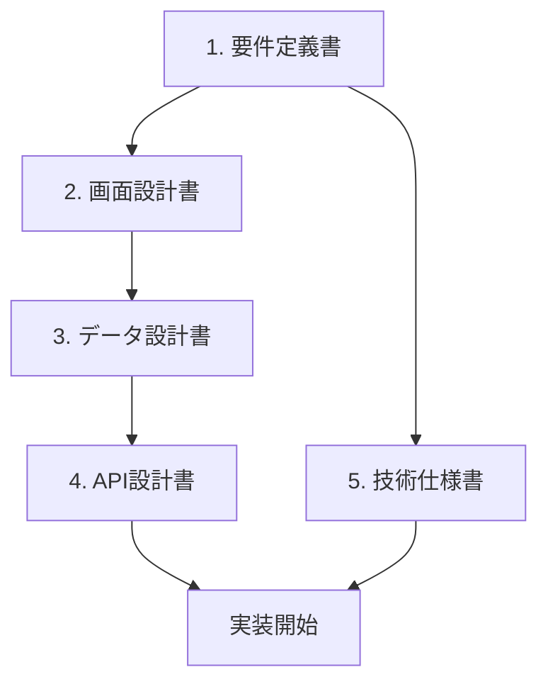

# ドキュメント一覧

このディレクトリには、Webアプリケーション開発に必要なドキュメントが格納されています。

## 📚 ドキュメント構成

### 1. [要件定義書](./01_requirements.md)
**目的**: プロジェクトの目的、機能要件、非機能要件を明確にする

**記載内容**:
- プロジェクト概要
- ターゲットユーザー
- 必須機能 (MVP)
- 将来的な機能
- 非機能要件 (パフォーマンス、セキュリティなど)
- 制約条件
- 成功指標 (KPI)

**いつ作成するか**: プロジェクト開始時、最初に作成

---

### 2. [画面設計書](./02_screen_design.md)
**目的**: アプリケーションの画面構成と遷移を定義する

**記載内容**:
- 画面一覧
- 画面遷移図
- 各画面の詳細仕様
  - レイアウト
  - 表示要素
  - 操作フロー
  - バリデーション
  - エラーハンドリング
- 共通UI要素
- レスポンシブ対応

**いつ作成するか**: 要件定義後、Figmaデザインと並行して作成

---

### 3. [データ設計書](./03_data_design.md)
**目的**: データベース構造とデータモデルを定義する

**記載内容**:
- ER図
- テーブル定義
- TypeScript型定義
- バリデーションルール
- データフロー
- ストレージ設計 (ファイル保存など)
- データ移行・シード

**いつ作成するか**: 画面設計と並行、または画面設計後

---

### 4. [API設計書](./04_api_design.md)
**目的**: フロントエンドとバックエンド間のインターフェースを定義する

**記載内容**:
- API概要 (ベースURL、認証方式)
- エンドポイント一覧
- 各エンドポイントの詳細
  - リクエスト形式
  - レスポンス形式
  - バリデーション
  - エラーハンドリング
- エラーコード一覧
- レート制限
- Webhook (オプション)

**いつ作成するか**: データ設計後、実装前

---

### 5. [技術仕様書](./05_technical_spec.md)
**目的**: 使用する技術スタックと開発方針を定義する

**記載内容**:
- アーキテクチャ概要
- 技術スタック
- ディレクトリ構成
- 開発環境セットアップ
- コーディング規約
- テスト戦略
- デプロイ戦略
- セキュリティ対策
- パフォーマンス最適化
- 監視・ロギング

**いつ作成するか**: プロジェクト開始時、技術選定後

---

## 🔄 ドキュメント作成の推奨フロー



### ステップバイステップ

1. **要件定義書を作成**
   - 何を作るのかを明確にする
   - ステークホルダーと合意を取る

2. **技術仕様書を作成** (並行可)
   - 使用する技術を決定する
   - 開発環境をセットアップする

3. **画面設計書を作成**
   - Figmaデザインを参照しながら作成
   - 画面遷移とUIを定義する

4. **データ設計書を作成**
   - 画面で必要なデータを洗い出す
   - データベース構造を設計する

5. **API設計書を作成**
   - フロントエンドとバックエンドのインターフェースを定義
   - データ設計と整合性を確認

6. **実装開始**
   - ドキュメントに基づいて実装を進める
   - 必要に応じてドキュメントを更新

---

## 💡 ドキュメント作成のヒント

### 最小限で始める場合

すべてのドキュメントを最初から完璧に作る必要はありません。小規模プロジェクトの場合は以下の順で作成することをお勧めします:

1. **要件定義書** (簡易版でOK)
2. **画面設計書** (主要画面のみ)
3. **API設計書** (必要なエンドポイントのみ)

### Figmaデザインがある場合

- 画面設計書にFigmaのリンクやスクリーンショットを貼り付ける
- Figmaのコンポーネント名と実装のコンポーネント名を一致させる
- デザインシステムを技術仕様書に反映する

### チーム開発の場合

- ドキュメントをGitで管理し、変更履歴を残す
- Pull Requestでドキュメントレビューを行う
- 実装とドキュメントの乖離を防ぐため、定期的に更新する

### AI (Gemini) に依頼する場合

これらのドキュメントを埋めた上で、以下のように依頼すると効率的です:

```
docs/ 配下のドキュメントを参照して、〇〇機能を実装してください
```

特に以下の情報があると、AIがより正確に実装できます:
- 画面設計書の具体的な画面レイアウト
- データ設計書のテーブル定義
- API設計書のエンドポイント仕様

---

## 📝 ドキュメントの更新

ドキュメントは **生きたドキュメント** として扱い、以下のタイミングで更新してください:

- 新機能追加時
- 仕様変更時
- バグ修正で仕様が変わった時
- リファクタリング後

### 更新のベストプラクティス

1. **変更履歴を残す**: Gitのコミットメッセージで変更理由を記載
2. **関連ドキュメントも更新**: 1つのドキュメントを変更したら、関連するドキュメントも確認
3. **実装とドキュメントを同じPRで**: コードとドキュメントの変更を同時に行う

---

## 🎯 次のステップ

1. まず [要件定義書](./01_requirements.md) を開いて、プロジェクトの概要を記入してください
2. Figmaデザインがある場合は、[画面設計書](./02_screen_design.md) にリンクやスクリーンショットを追加してください
3. 使用する技術が決まっている場合は、[技術仕様書](./05_technical_spec.md) を更新してください

ドキュメントが揃ったら、AIに「これらのドキュメントを参照して実装してください」と依頼することで、スムーズに開発を進められます。

---

## ❓ 質問・サポート

ドキュメントの書き方や内容について不明な点があれば、お気軽にお尋ねください。
