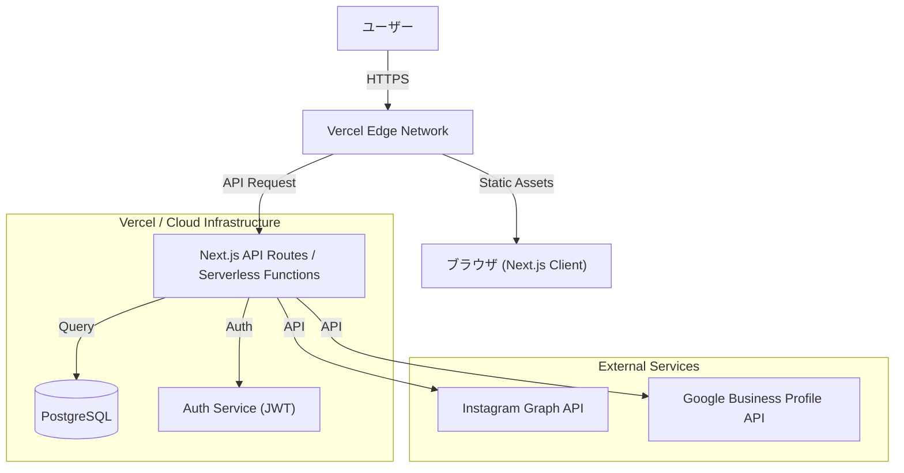

# アーキテクチャ

## 概要
（ここに現状構成を書く）
### 1.1 システム構成図

### 1.2 サーバーレスアーキテクチャの採用
本システムでは、**Next.js** と **Vercel** を組み合わせたサーバーレスアーキテクチャを採用します。これにより、インフラ管理の手間を最小限に抑えつつ、高いスケーラビリティとコスト効率を実現します。
- **API Routes as Serverless Functions**:
  - `pages/api/` ディレクトリ内に作成されたファイルは、Vercelへのデプロイ時にそれぞれが独立したサーバーレス関数（Serverless Function）としてデプロイされます。
  - 各APIエンドポイントは、リクエストに応じて個別に起動・実行され、処理が完了すると自動的に停止します。
- **主なメリット**:
  - **自動スケーリング**: トラフィックの増減に応じて、Vercelが自動的にリソースを割り当てます。これにより、アクセス集中時にも安定したパフォーマンスを維持します。
  - **コスト効率**: リクエストが発生したときのみコンピューティングリソースが消費されるため、アイドル時間帯のコストが発生しません。
  - **運用負荷の軽減**: サーバーのプロビジョニング、OSのパッチ適用、セキュリティ管理といったインフラ運用業務が不要になります。

## 技術スタック

#### フロントエンド

| カテゴリ | 技術 | バージョン | 用途 |
|---------|------|-----------|------|
| フレームワーク | Next.js | 14.x | Reactフレームワーク |
| UI ライブラリ | React | 18.x | UIコンポーネント |
| 言語 | TypeScript | 5.x | 型安全な開発 |
| スタイリング |  Tailwind CSS | - | スタイリング |
| 状態管理 | | - | グローバル状態管理 |
| フォーム | React Hook Form | - | フォーム管理 |
| バリデーション |  | - | スキーマバリデーション |
| HTTP クライアント | | - | API通信 |
| スタイリング |  Tailwind CSS | 3.x | スタイリング |
| アイコン | React Icons | 5.x | アイコンセット |
| 状態管理 | React Context / Hooks | - | グローバル状態管理 |
| フォーム | React Hook Form | (導入予定) | フォーム管理 |
| ユーティリティ | clsx / tailwind-merge | - | クラス名操作 (utils/cn.ts) |

