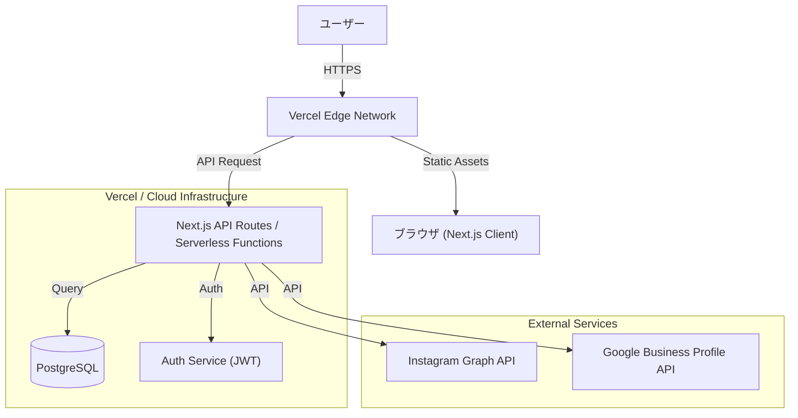
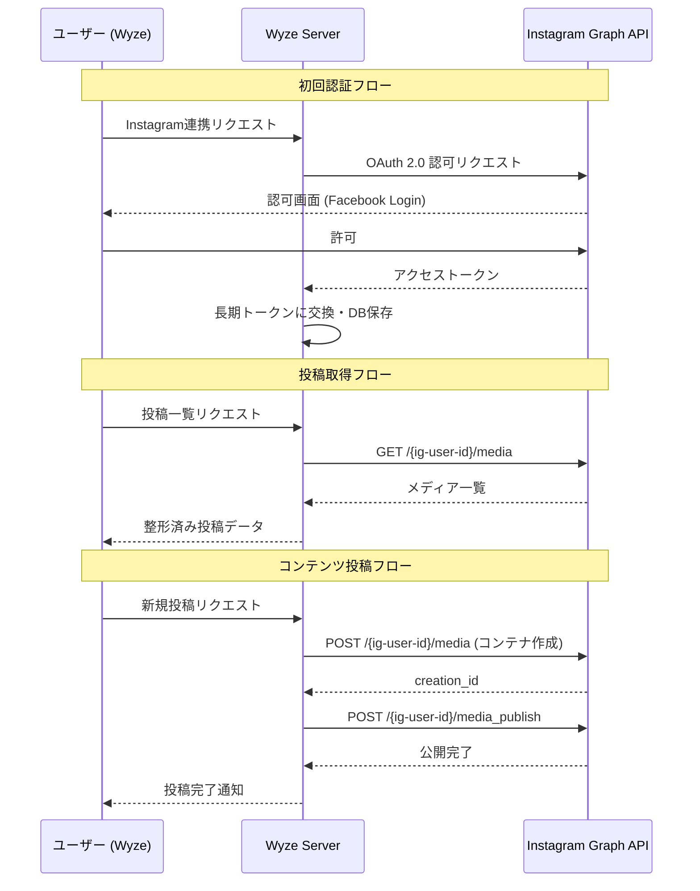
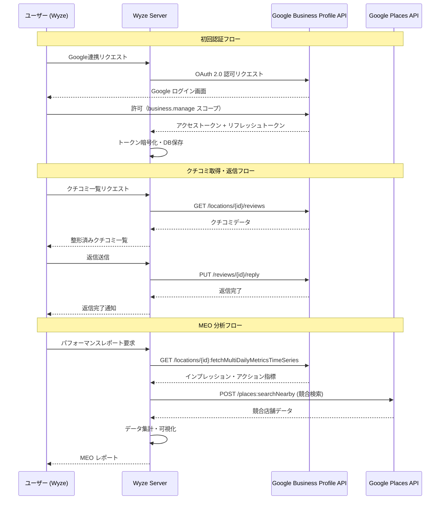

# アーキテクチャ

## 概要
（ここに現状構成を書く）
### 1.1 システム構成図

```mermaid
graph TD
    User[ユーザー] -->|HTTPS| CDN[Vercel Edge Network]
    CDN -->|Static Assets| Browser["ブラウザ (Next.js Client)"]
    CDN -->|API Request| Server[Next.js API Routes / Serverless Functions]
    
    subgraph "Vercel / Cloud Infrastructure"
        Server -->|Query| DB[(PostgreSQL)]
        Server -->|Auth| Auth["Auth Service (JWT)"]
    end
    
    subgraph "External Services"
        Server -->|API| Insta[Instagram Graph API]
        Server -->|API| Google[Google Business Profile API]
    end
```

### 1.2 サーバーレスアーキテクチャの採用
本システムでは、**Next.js** と **Vercel** を組み合わせたサーバーレスアーキテクチャを採用します。これにより、インフラ管理の手間を最小限に抑えつつ、高いスケーラビリティとコスト効率を実現します。
- **API Routes as Serverless Functions**:
  - `pages/api/` ディレクトリ内に作成されたファイルは、Vercelへのデプロイ時にそれぞれが独立したサーバーレス関数（Serverless Function）としてデプロイされます。
  - 各APIエンドポイントは、リクエストに応じて個別に起動・実行され、処理が完了すると自動的に停止します。
- **主なメリット**:
  - **自動スケーリング**: トラフィックの増減に応じて、Vercelが自動的にリソースを割り当てます。これにより、アクセス集中時にも安定したパフォーマンスを維持します。
  - **コスト効率**: リクエストが発生したときのみコンピューティングリソースが消費されるため、アイドル時間帯のコストが発生しません。
  - **運用負荷の軽減**: サーバーのプロビジョニング、OSのパッチ適用、セキュリティ管理といったインフラ運用業務が不要になります。

## 技術スタック

#### フロントエンド

| カテゴリ | 技術 | バージョン | 用途 |
|---------|------|-----------|------|
| フレームワーク | Next.js | 14.x | Reactフレームワーク |
| UI ライブラリ | React | 18.x | UIコンポーネント |
| 言語 | TypeScript | 5.x | 型安全な開発 |
| スタイリング |  Tailwind CSS | - | スタイリング |
| 状態管理 | | - | グローバル状態管理 |
| フォーム | React Hook Form | - | フォーム管理 |
| バリデーション |  | - | スキーマバリデーション |
| HTTP クライアント | | - | API通信 |
| スタイリング |  Tailwind CSS | 3.x | スタイリング |
| アイコン | React Icons | 5.x | アイコンセット |
| 状態管理 | React Context / Hooks | - | グローバル状態管理 |
| フォーム | React Hook Form | (導入予定) | フォーム管理 |
| ユーティリティ | clsx / tailwind-merge | - | クラス名操作 (utils/cn.ts) |

---

## Instagram Graph API

本システム（Wyze System）で使用する Instagram API の設計。
Instagram Graph API は **Business / Creator アカウント** 専用の公式 API であり、Basic Display API は 2024 年に廃止済み。

> 参照: [Instagram Graph API 公式ドキュメント](https://developers.facebook.com/docs/instagram-api/)

### 認証・認可

| 項目 | 内容 |
|------|------|
| プロトコル | OAuth 2.0（Facebook Login 経由） |
| アクセストークン | ユーザーアクセストークン（60日間の長期トークン推奨） |
| 前提条件 | Facebook ページと Instagram Business/Creator アカウントの紐付け |
| API バージョン | v21.0 以降（最新安定版を使用） |

### 必要なパーミッション

| スコープ | 用途 | Wyze での利用箇所 |
|---------|------|------------------|
| `instagram_basic` | プロフィール情報・メディア一覧の読み取り | アカウント連携、投稿一覧表示 |
| `instagram_content_publish` | フィード・リール・ストーリーの投稿 | 投稿管理（作成・スケジュール） |
| `instagram_manage_comments` | コメントの取得・返信・削除 | 口コミ・コメント管理 |
| `instagram_manage_insights` | インサイト（分析指標）の取得 | レポート・分析ダッシュボード |
| `pages_show_list` | 紐付き Facebook ページ一覧の取得 | アカウント連携フロー |
| `pages_read_engagement` | ページのエンゲージメントデータ読み取り | MEO 分析補助 |

### 使用するエンドポイント一覧

#### 1. アカウント情報（IG User）

| メソッド | エンドポイント | 説明 | Wyze 機能 |
|---------|---------------|------|-----------|
| GET | `/{ig-user-id}` | ビジネスアカウントのプロフィール情報取得 | アカウント設定画面 |
| GET | `/{ig-user-id}?fields=biography,username,profile_picture_url,followers_count,media_count` | プロフィール詳細フィールド | ダッシュボード表示 |

#### 2. メディア管理（IG Media）

| メソッド | エンドポイント | 説明 | Wyze 機能 |
|---------|---------------|------|-----------|
| GET | `/{ig-user-id}/media` | ユーザーのメディア一覧取得 | 投稿一覧（Tab 2） |
| GET | `/{ig-media-id}` | 個別メディア詳細取得 | 投稿詳細画面 |
| GET | `/{ig-media-id}?fields=id,caption,media_type,media_url,thumbnail_url,permalink,timestamp,like_count,comments_count` | メディアの詳細フィールド | 投稿一覧・詳細表示 |

#### 3. コンテンツ投稿（Content Publishing）

投稿は2段階のプロセスで行う: ① メディアコンテナ作成 → ② 公開

| メソッド | エンドポイント | 説明 | Wyze 機能 |
|---------|---------------|------|-----------|
| POST | `/{ig-user-id}/media` | メディアコンテナ作成（画像/動画/カルーセル/リール/ストーリー） | 投稿作成 |
| POST | `/{ig-user-id}/media_publish` | コンテナの公開 | 投稿公開 |
| GET | `/{ig-user-id}/content_publishing_limit` | 投稿上限の残数確認 | 投稿前のバリデーション |

**コンテナ作成パラメータ例（画像投稿）:**
```json
{
  "image_url": "https://example.com/image.jpg",
  "caption": "投稿テキスト #ハッシュタグ",
  "location_id": "ロケーションID（任意）"
}
```

**対応メディアタイプ:**

| タイプ | パラメータ | 備考 |
|--------|-----------|------|
| 画像 | `image_url` | JPEG 推奨、最大 8MB |
| 動画（リール） | `video_url`, `media_type=REELS` | MP4、最大 15 分 |
| カルーセル | `children` (子コンテナ ID 配列) | 最大 10 枚 |
| ストーリー | `media_type=STORIES` | 24 時間で自動消去 |

#### 4. コメント管理（IG Comment）

| メソッド | エンドポイント | 説明 | Wyze 機能 |
|---------|---------------|------|-----------|
| GET | `/{ig-media-id}/comments` | メディアに対するコメント一覧 | コメント一覧表示 |
| GET | `/{ig-comment-id}` | コメント詳細取得 | コメント詳細 |
| GET | `/{ig-comment-id}/replies` | コメントへの返信一覧 | スレッド表示 |
| POST | `/{ig-comment-id}/replies` | コメントへの返信 | 口コミ返信機能 |
| DELETE | `/{ig-comment-id}` | コメント削除 | コメント管理 |

#### 5. インサイト・分析（IG Insights）

| メソッド | エンドポイント | 説明 | Wyze 機能 |
|---------|---------------|------|-----------|
| GET | `/{ig-user-id}/insights` | アカウントレベルのインサイト | 月次レポート |
| GET | `/{ig-media-id}/insights` | メディア単位のインサイト | 投稿パフォーマンス分析 |

**アカウントインサイト指標（v21.0 以降有効）:**

| メトリクス | 説明 | period |
|-----------|------|--------|
| `reach` | リーチしたユニークアカウント数 | day, week, days_28 |
| `impressions` | インプレッション数 | day, week, days_28 |
| `follower_count` | フォロワー数の推移 | day |
| `accounts_engaged` | エンゲージしたアカウント数 | day |

**メディアインサイト指標:**

| メトリクス | 説明 | 対象 |
|-----------|------|------|
| `reach` | リーチ数 | 全メディア |
| `impressions` | インプレッション数 | 全メディア |
| `saved` | 保存数 | 全メディア |
| `likes` | いいね数 | 全メディア |
| `comments` | コメント数 | 全メディア |
| `shares` | シェア数 | 全メディア |
| `plays` | 再生数 | リール・動画 |

> **v21.0 での廃止メトリクス（使用不可）:** `video_views`（非リール）, `email_contacts`, `profile_views`, `website_clicks`, `phone_call_clicks`, `text_message_clicks`

#### 6. ハッシュタグ検索（Hashtag Search）

| メソッド | エンドポイント | 説明 | Wyze 機能 |
|---------|---------------|------|-----------|
| GET | `/ig_hashtag_search?q={keyword}` | ハッシュタグ ID の検索 | MEO キーワード分析 |
| GET | `/{ig-hashtag-id}/top_media` | 人気投稿の取得 | 競合・トレンド分析 |
| GET | `/{ig-hashtag-id}/recent_media` | 最新投稿の取得 | トレンド分析 |

### レート制限

| 制限種別 | 上限 | 備考 |
|---------|------|------|
| API コール | 200 リクエスト / 時間 / アカウント | 2025年以降の制限値 |
| コンテンツ投稿 | 100 件 / 24 時間（ローリング） | フィード + リール + ストーリー合計、カルーセルは 1 件扱い |
| ハッシュタグ検索 | 30 ユニークハッシュタグ / 7 日間 | ユーザー単位 |

### Wyze System での実装方針


```mermaid
sequenceDiagram
    participant U as ユーザー (Wyze)
    participant S as Wyze Server
    participant IG as Instagram Graph API

    Note over U,IG: 初回認証フロー
    U->>S: Instagram連携リクエスト
    S->>IG: OAuth 2.0 認可リクエスト
    IG-->>U: 認可画面 (Facebook Login)
    U->>IG: 許可
    IG-->>S: アクセストークン
    S->>S: 長期トークンに交換・DB保存

    Note over U,IG: 投稿取得フロー
    U->>S: 投稿一覧リクエスト
    S->>IG: GET /{ig-user-id}/media
    IG-->>S: メディア一覧
    S-->>U: 整形済み投稿データ

    Note over U,IG: コンテンツ投稿フロー
    U->>S: 新規投稿リクエスト
    S->>IG: POST /{ig-user-id}/media (コンテナ作成)
    IG-->>S: creation_id
    S->>IG: POST /{ig-user-id}/media_publish
    IG-->>S: 公開完了
    S-->>U: 投稿完了通知
```

#### 設計上の考慮事項

1. **トークン管理**: 長期トークン（60 日）を DB に暗号化保存し、期限前に自動リフレッシュ
2. **レート制限対策**: リクエストキューイングとキャッシュ（TTL: 投稿一覧 5 分、インサイト 1 時間）
3. **Webhook 活用**: コメント通知にはリアルタイム Webhook を利用し、ポーリングを最小化
4. **エラーハンドリング**: API エラー（レート超過 429、トークン失効 190）に対するリトライ・再認証フロー
5. **データ同期**: インサイトデータは日次バッチで取得・DB 蓄積し、レポート生成時は DB から参照

---

## Google API（Google Business Profile API / Google Maps Platform）

本システムでは Google Business Profile（以下 GBP）API と Google Maps Platform の Places API を組み合わせ、MEO（Map Engine Optimization）機能とクチコミ管理を実現する。

> 参照: [Google Business Profile APIs](https://developers.google.com/my-business) / [Google Maps Platform](https://developers.google.com/maps)

### 認証・認可

| 項目 | 内容 |
|------|------|
| プロトコル | OAuth 2.0（Google アカウント認証） |
| OAuth スコープ | `https://www.googleapis.com/auth/business.manage` |
| API キー | Google Maps Platform（Places API 等）で使用 |
| 前提条件 | Google Cloud Console でプロジェクト作成、各 API の有効化、OAuth 同意画面の構成 |
| GBP アクセス | ビジネスオーナーまたは管理者権限を持つ Google アカウント |

### API 構成と Wyze での役割

Wyze System では以下の API 群を使用する。

| API 名 | ベース URL | Wyze での役割 |
|--------|-----------|--------------|
| My Business Account Management API | `https://mybusinessaccountmanagement.googleapis.com/v1/` | アカウント・ロケーション管理 |
| My Business Business Information API | `https://mybusinessbusinessinformation.googleapis.com/v1/` | 店舗情報の取得・更新 |
| My Business Reviews API (v4) | `https://mybusiness.googleapis.com/v4/` | クチコミの取得・返信 |
| Business Profile Performance API | `https://businessprofileperformance.googleapis.com/v1/` | パフォーマンス指標の取得 |
| Places API (New) | `https://places.googleapis.com/v1/` | 店舗検索・競合分析・地図表示 |
| Maps JavaScript API | ブラウザ SDK | 地図の埋め込み表示 |

### 使用するエンドポイント一覧

#### 1. アカウント・ロケーション管理

| メソッド | エンドポイント | 説明 | Wyze 機能 |
|---------|---------------|------|-----------|
| GET | `/v1/accounts` | ユーザーに紐づくアカウント一覧 | アカウント連携 |
| GET | `/v1/accounts/{accountId}/locations` | アカウント配下のロケーション（店舗）一覧 | 店舗選択 |
| GET | `/v1/locations/{locationId}` | ロケーション詳細取得 | 店舗情報表示 |
| PATCH | `/v1/locations/{locationId}` | ロケーション情報の更新 | 店舗情報編集（営業時間・説明等） |

#### 2. クチコミ管理（Reviews）

| メソッド | エンドポイント | 説明 | Wyze 機能 |
|---------|---------------|------|-----------|
| GET | `/v4/accounts/{accountId}/locations/{locationId}/reviews` | クチコミ一覧取得 | クチコミ一覧（Tab 1-C） |
| GET | `/v4/accounts/{accountId}/locations/{locationId}/reviews/{reviewId}` | 個別クチコミ取得 | クチコミ詳細 |
| PUT | `/v4/accounts/{accountId}/locations/{locationId}/reviews/{reviewId}/reply` | クチコミへの返信 | 口コミ返信機能 |
| DELETE | `/v4/accounts/{accountId}/locations/{locationId}/reviews/{reviewId}/reply` | 返信の削除 | 返信管理 |
| POST | `/v4/accounts/{accountId}/locations:batchGetReviews` | 複数ロケーションのクチコミ一括取得 | 多店舗管理 |

**クチコミオブジェクトの主要フィールド:**

| フィールド | 型 | 説明 |
|-----------|-----|------|
| `reviewId` | string | クチコミの一意識別子 |
| `reviewer.displayName` | string | 投稿者名 |
| `starRating` | enum | 評価（ONE〜FIVE） |
| `comment` | string | クチコミ本文 |
| `createTime` | timestamp | 投稿日時 |
| `updateTime` | timestamp | 更新日時 |
| `reviewReply.comment` | string | オーナー返信本文 |

#### 3. パフォーマンス指標（Performance API）

| メソッド | エンドポイント | 説明 | Wyze 機能 |
|---------|---------------|------|-----------|
| GET | `/v1/locations/{locationId}:fetchMultiDailyMetricsTimeSeries` | 複数メトリクスの日次時系列データ取得 | レポート・ダッシュボード |
| GET | `/v1/locations/{locationId}/searchkeywords/impressions/monthly` | 検索キーワード別月次インプレッション | MEO キーワード分析 |

**取得可能な DailyMetric:**

| メトリクス | 説明 | Wyze 機能 |
|-----------|------|-----------|
| `BUSINESS_IMPRESSIONS_DESKTOP_MAPS` | Google マップ（デスクトップ）での表示回数 | MEO 効果測定 |
| `BUSINESS_IMPRESSIONS_DESKTOP_SEARCH` | Google 検索（デスクトップ）での表示回数 | MEO 効果測定 |
| `BUSINESS_IMPRESSIONS_MOBILE_MAPS` | Google マップ（モバイル）での表示回数 | MEO 効果測定 |
| `BUSINESS_IMPRESSIONS_MOBILE_SEARCH` | Google 検索（モバイル）での表示回数 | MEO 効果測定 |
| `WEBSITE_CLICKS` | ウェブサイトクリック数 | アクション分析 |
| `CALL_CLICKS` | 電話発信クリック数 | アクション分析 |
| `BUSINESS_DIRECTION_REQUESTS` | ルート検索リクエスト数 | アクション分析 |
| `BUSINESS_BOOKINGS` | 予約数 | アクション分析 |
| `BUSINESS_FOOD_ORDERS` | フードオーダー数 | 飲食店 KPI |

#### 4. Places API（New）

Google Maps Platform の Places API を使用し、店舗の検索・地図表示・競合分析を行う。

| メソッド | エンドポイント | 説明 | Wyze 機能 |
|---------|---------------|------|-----------|
| POST | `/v1/places:searchText` | テキスト検索（店名・カテゴリ・エリア） | 競合店舗検索 |
| POST | `/v1/places:searchNearby` | 周辺検索（座標 + 半径） | 近隣競合分析 |
| GET | `/v1/places/{placeId}` | プレイス詳細取得（評価・クチコミ・写真） | 競合情報表示 |
| GET | `/v1/places/{placeId}/photos/{photoId}/media` | プレイス写真の取得 | 店舗画像表示 |

**Place Details で取得する主要フィールド:**

| フィールド | 説明 | Wyze での用途 |
|-----------|------|-------------|
| `displayName` | 店舗名 | 店舗一覧表示 |
| `formattedAddress` | 住所 | 地図連携 |
| `rating` | 総合評価（1.0〜5.0） | 競合比較 |
| `userRatingCount` | クチコミ総数 | 競合比較 |
| `reviews[]` | クチコミ一覧 | 競合クチコミ分析 |
| `regularOpeningHours` | 営業時間 | 店舗情報 |
| `photos[]` | 写真一覧 | 店舗画像表示 |
| `googleMapsUri` | Google マップ URL | マップリンク |
| `websiteUri` | 公式サイト URL | 店舗情報 |

#### 5. Maps JavaScript API

| 用途 | 説明 | Wyze 機能 |
|------|------|-----------|
| 地図埋め込み | ダッシュボードへの Google マップ表示 | 店舗位置の可視化 |
| マーカー表示 | 自店舗・競合店舗の位置マーキング | MEO 分析画面 |
| Place Autocomplete | 住所入力補完 | 店舗情報登録 |

### レート制限・料金

#### Google Business Profile API

| 制限種別 | 上限 | 備考 |
|---------|------|------|
| API コール | 2,400 リクエスト / 分 / ユーザー / プロジェクト | デフォルト値、増枠申請可 |
| ロケーション編集 | 10 回 / 分 / ロケーション | 増枠不可 |
| バッチリクエスト | リクエストに含まれる個別操作がそれぞれカウント | — |

#### Google Maps Platform（Places API 等）

| SKU | 無料枠（月間） | 超過時単価（1,000 リクエスト） |
|-----|-------------|--------------------------|
| Places API（Essentials） | 10,000 リクエスト | $2〜5 |
| Text Search（Pro） | 5,000 リクエスト | $10〜32 |
| Nearby Search（Pro） | 5,000 リクエスト | $10〜32 |
| Place Details（Pro） | 5,000 リクエスト | $10〜17 |
| Place Photos | 5,000 リクエスト | $7 |
| Maps JavaScript API | 28,500 マップロード | $7 |

> 2025 年 3 月以降、従来の月 $200 クレジットは廃止され、各 SKU ごとの無料枠モデルに移行済み。

### Wyze System での実装方針


```mermaid
sequenceDiagram
    participant U as ユーザー (Wyze)
    participant S as Wyze Server
    participant GBP as Google Business Profile API
    participant GP as Google Places API

    Note over U,GP: 初回認証フロー
    U->>S: Google連携リクエスト
    S->>GBP: OAuth 2.0 認可リクエスト
    GBP-->>U: Google ログイン画面
    U->>GBP: 許可（business.manage スコープ）
    GBP-->>S: アクセストークン + リフレッシュトークン
    S->>S: トークン暗号化・DB保存

    Note over U,GP: クチコミ取得・返信フロー
    U->>S: クチコミ一覧リクエスト
    S->>GBP: GET /locations/{id}/reviews
    GBP-->>S: クチコミデータ
    S-->>U: 整形済みクチコミ一覧
    U->>S: 返信送信
    S->>GBP: PUT /reviews/{id}/reply
    GBP-->>S: 返信完了
    S-->>U: 返信完了通知

    Note over U,GP: MEO 分析フロー
    U->>S: パフォーマンスレポート要求
    S->>GBP: GET /locations/{id}:fetchMultiDailyMetricsTimeSeries
    GBP-->>S: インプレッション・アクション指標
    S->>GP: POST /places:searchNearby (競合検索)
    GP-->>S: 競合店舗データ
    S->>S: データ集計・可視化
    S-->>U: MEO レポート
```

#### 設計上の考慮事項

1. **トークン管理**: リフレッシュトークンを DB に暗号化保存し、アクセストークン期限切れ時に自動リフレッシュ
2. **API キー管理**: Maps Platform の API キーはサーバーサイドで環境変数管理、リファラ制限を設定
3. **レート制限対策**: Exponential Backoff によるリトライ、リクエストキューイング
4. **コスト最適化**: Places API は必要なフィールドのみリクエスト（フィールドマスク）してコスト節約、キャッシュ活用（TTL: 店舗情報 24 時間、クチコミ 15 分）
5. **データ同期**: Performance API のメトリクスは日次バッチで取得・DB 蓄積、クチコミは Webhook 通知 + 定期ポーリング（15 分間隔）
6. **廃止 API の回避**: Q&A API は 2025 年 11 月に廃止済み、使用しない

