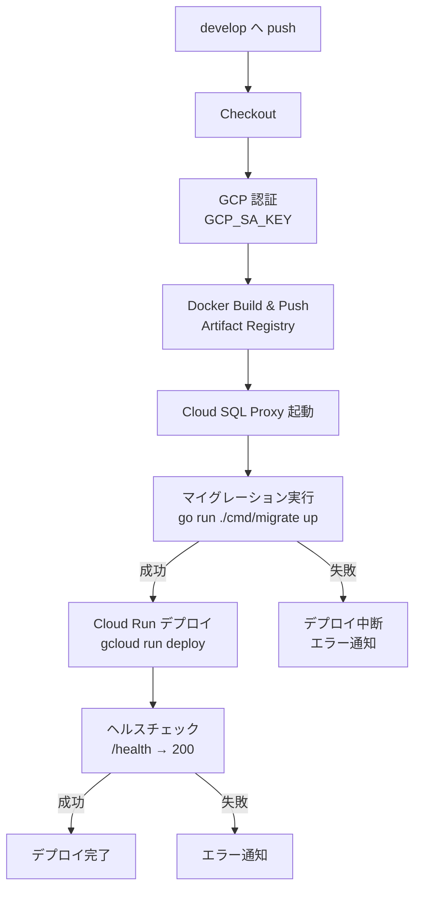

# CI/CD パイプライン

## CI (継続的インテグレーション)

ファイル: `.github/workflows/ci.yml`
トリガー: `main`, `develop` ブランチへの PR

| ジョブ | 内容 |
|--------|------|
| frontend-lint | Next.js の ESLint |
| frontend-test | Jest テスト |
| backend-lint | golangci-lint |
| backend-unit-test | Go 単体テスト (`./internal/...`) |
| backend-integration-test | PostgreSQL コンテナ使用の結合テスト |

## CD Staging (継続的デプロイ)

ファイル: `.github/workflows/cd-staging.yml`
トリガー: `develop` ブランチへの push (`backend/**` パス変更時)

### デプロイフロー

### 必要な GitHub Secrets

| Secret 名 | 値 | 説明 |
|-----------|-----|------|
| `GCP_SA_KEY` | サービスアカウント JSON キー | `/tmp/gcp-sa-key.json` の内容 |
| `DATABASE_URL_TCP` | `postgres://wyze_app:<password>@127.0.0.1:5432/wyze_db?sslmode=disable` | マイグレーション用 (Cloud SQL Proxy 経由 TCP 接続) |

### GitHub Secrets の登録手順

1. GitHubリポジトリ → Settings → Secrets and variables → Actions
2. 「New repository secret」をクリック
3. `GCP_SA_KEY`: `/tmp/gcp-sa-key.json` の内容をそのまま貼り付け
4. `GCP_PROJECT_ID`: `wyze-develop-staging`
5. `DATABASE_URL_TCP`: `postgres://wyze_app:<password>@127.0.0.1:5432/wyze_db?sslmode=disable`
   - `<password>` は Secret Manager の `DATABASE_URL` に含まれるパスワード

### GCP サービスアカウント

- 名前: `github-actions-deploy@wyze-develop-staging.iam.gserviceaccount.com`
- 付与ロール:
  - `roles/run.developer` — Cloud Run デプロイ
  - `roles/artifactregistry.writer` — イメージプッシュ
  - `roles/storage.objectViewer` — Cloud Build ストレージ参照
  - `roles/secretmanager.secretAccessor` — シークレット読み取り
  - `roles/cloudsql.client` — Cloud SQL Proxy 接続
  - `roles/iam.serviceAccountUser` — Cloud Run SA の代理

### デプロイ対象

| 項目 | 値 |
|------|-----|
| Cloud Run サービス | `backend` |
| リージョン | `us-east1` |
| イメージ | `us-east1-docker.pkg.dev/wyze-develop-staging/web-system-pj/backend` |
| タグ | `<commit SHA>` + `latest` |

### フロントエンド (暫定)

- `NEXT_PUBLIC_API_URL`: `https://backend-611370943102.us-east1.run.app`
- CORS: 現在 `*` (全許可)。本番移行時にドメイン制限要。
