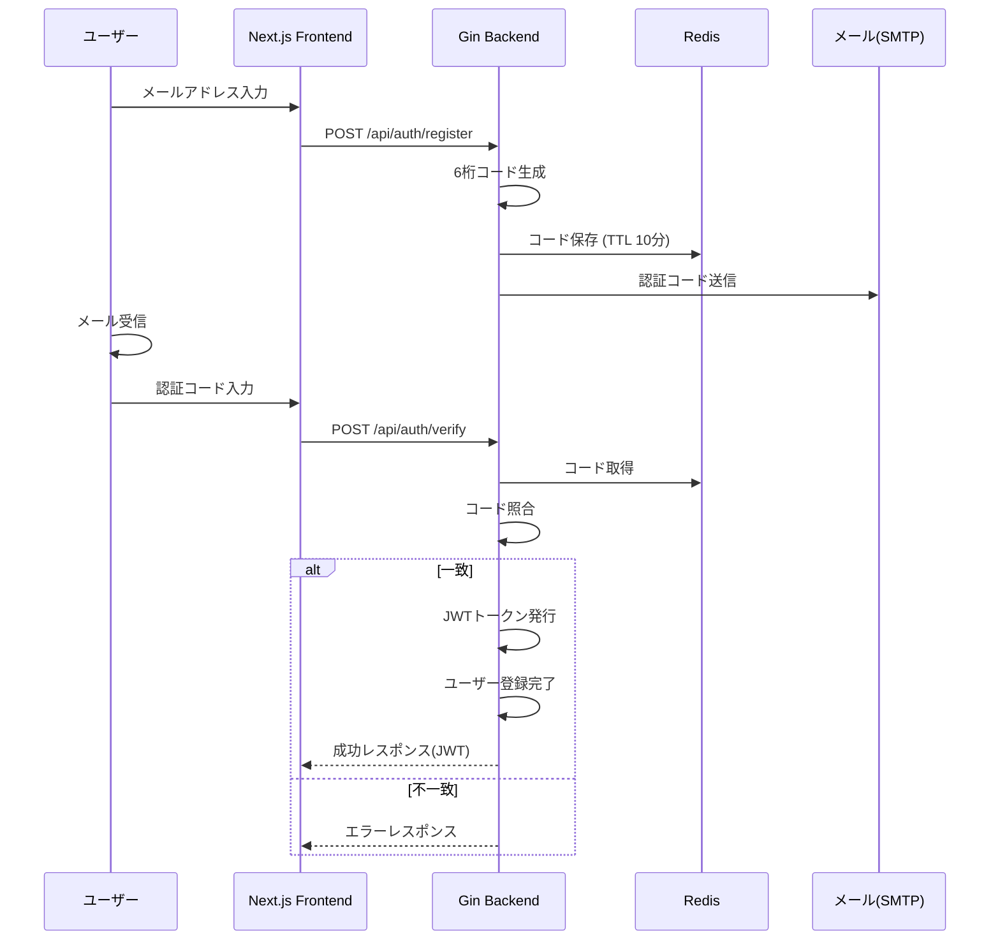

# プロジェクト要件定義書 (Wyze System)

## 要求:ステージング検証で起きた問題 (`docs/testResult.md`) の解決

### 要件1.新規登録時に認証番号が届かない

#### 届くメールの内容

- 送信者:support@wyze-sytem.com
- 受信者:【新規登録の時に入力したメールアドレス】
- 本文:wyze systemをご利用いただきありがとうございます\n 【新規登録の時に入力したメールアドレス】で新規登録していただくための認証番号は **【認証番号】** です

#### 要求動作

#### 解決策
- デプロイ失敗,もしくは間違ったブランチをデプロイしている?
  - email_verificationsテーブルなど既にロジックは構築済み
  - 複数回のデプロイを試してみてそれでもダメなら新しいvercelプロジェクトを作成しステージングリリースをやり直す

### 要件2.

